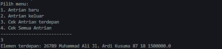

# JOBSHEET 8 : QUEUE 
## NAMA: MUHAMMAD DZAKA MURRAN RUISD
## KELAS/ABS: 1F_D4-TI/18

### 8.1 Tujuan Praktikum
Setelah melakukan materi praktikum ini, mahasiswa mampu:
1. Mengenal struktur data Queue
2. Membuat dan mendeklarasikan struktur data Queue
3. Menerapkan algoritma Queue dengan menggunakan array

### 8.2 Praktikum 1
Waktu percobaan : 45 menit
Pada percobaan ini, kita akan mengimplementasikan penggunaan class Queue.
8.2.1 Langkah-langkah Percobaan
1. Perhatikan Diagram Class Queue berikut ini:
Queue
data: int[]
front: int
rear: int
size: int
max: int
Queue(n: int)
isFull(): boolean
isEmpty(): boolean
enqueue(dt: int): void
dequeue(): int
peek: void
print(): void
clear(): void
Berdasarkan diagram class tersebut, akan dibuat program class Queue dalam Java.
2. Buat package dengan nama Praktikum1, kemudian buat class baru dengan nama Queue.
3. Tambahkan atribut-atribut Queue sesuai diagram class, kemudian tambahkan pula 
konstruktornya seperti gambar berikut ini
4. Buat method IsEmpty bertipe boolean yang digunakan untuk mengecek apakah queue kosong.
5. Buat method IsFull bertipe boolean yang digunakan untuk mengecek apakah queue sudah penuh.
6. Buat method peek bertipe void untuk menampilkan elemen queue pada posisi paling depan.
7. Buat method print bertipe void untuk menampilkan seluruh elemen pada queue mulai dari posisi
front sampai dengan posisi rear.
8. Buat method clear bertipe void untuk menghapus semua elemen pada queue
9. Buat method Enqueue bertipe void untuk menambahkan isi queue dengan parameter dt yang 
bertipe integer
10. Buat method Dequeue bertipe int untuk mengeluarkan data pada queue di posisi belakang
11. Selanjutnya, buat class baru dengan nama QueueMain tetap pada package Praktikum1. Buat 
method menu bertipe void untuk memilih menu program pada saat dijalankan.
12. Buat fungsi main, kemudian deklarasikan Scanner dengan nama sc.
13. Buat variabel n untuk menampung masukan berupa jumlah maksimal elemen yang dapat 
disimpan pada queue.
14. Lakukan instansiasi objek Queue dengan nama Q dengan mengirimkan parameter n sebagai 
kapasitas elemen queue
15. Deklarasikan variabel dengan nama pilih bertipe integer untuk menampung pilih menu dari 
pengguna.
16. Lakukan perulangan menggunakan do-while untuk menjalankan program secara terus menerus 
sesuai masukan yang diberikan. Di dalam perulangan tersebut, terdapat pemilihan kondisi 
menggunakan switch-case untuk menjalankan operasi queue sesuai dengan masukan pengguna.
17. Compile dan jalankan class QueueMain, kemudian amati hasilnya.
#### 8.2.2 Verifikasi Hasil Percobaan


#### 8.2.3 Pertanyaan
1. Pada konstruktor, mengapa nilai awal atribut front dan rear bernilai -1, sementara atribut size bernilai 0?

**Jawaban: Karena atribut front dan near diawal-awal tidak merujuk kepada indeks manapun (masih kosong) sedangkan size bernilai 0 karena array masih kosong.**

2. Pada method Enqueue, jelaskan maksud dan kegunaan dari potongan kode berikut!
```java
 if (front == max - 1) {
                    front = 0;
```

**Jawaban: Kegunaan potongan kode tersebut adalah untuk mengembalikan variabel front ke indeks awal karena array tersebut sudah penuh**

3. Pada method Dequeue, jelaskan maksud dan kegunaan dari potongan kode berikut!
```java
 if (rear == max - 1) {
                    rear = 0;
```

**Jawaban: Kegunaan potongan kode tersebut adalah untuk mengembalikan variabel front ke indeks awal karena array tersebut sudah penuh**

4. Pada method print, mengapa pada proses perulangan variabel i tidak dimulai dari 0 (int i=0), melainkan int i=front?

**Jawaban: Kegunaan potongan kode tersebut adalah untuk mengembalikan variabel front ke indeks awal karena array tersebut sudah penuh**


5. Perhatikan kembali method print, jelaskan maksud dari potongan kode berikut!
```java
i = i (i+1) % max;
```

**Jawaban: Memberitahu indeks sudah di indeks terakhir (max) sehingga jika iya akan dihentikan**

6. Tunjukkan potongan kode program yang merupakan queue overflow!
```java
if(isFull()){
    System.out.println("Queue sudah penuh");
}
```


7. Pada saat terjadi queue overflow dan queue underflow, program tersebut tetap dapat berjalan 
dan hanya menampilkan teks informasi. Lakukan modifikasi program sehingga pada saat terjadi 
queue overflow dan queue underflow, program dihentikan

**Jawaban:**
```java
 public void Enqueue(int dt) {
        if (IsFull()) {
            System.exit(0); //modifikasi
        } else {
            if (IsEmpty()) {
                front = rear = 0;
            } else {
                if (rear == max - 1) {
                    rear = 0;
                } else {
                    rear++;
                }
            }
            data[rear] = dt;
            size++;
        }
    }

    public int Dequeue() {

        int dt = 0;
        if (IsEmpty()) {
            System.exit(0); //modifikasi
        } else {
            dt = data[front];
            size--;
            if (IsEmpty()) {
                front = rear = -1;
            } else {
                if (front == max - 1) {
                    front = 0;
                } else {
                    front++;
                }
            }
        }
        return dt;
    }
```

### 8.3 Praktikum 2
Waktu percobaan : 45 menit
Pada percobaan ini, kita akan membuat program yang mengilustrasikan teller di bank dalam 
melayani nasabah.
#### 8.3.1 Langkah-langkah Percobaan
1. Perhatikan Diagram Class berikut ini:
Nasabah
norek: String
nama: String
alamat: String
umur: int
saldo: double
Nasabah(norek: String, nama: String, alamat: String, umur: int, saldo: double)
Berdasarkan diagram class tersebut, akan dibuat program class Nasabah dalam Java.
2. Buat package dengan nama Praktikum2, kemudian buat class baru dengan nama Nasabah.
3. Tambahkan atribut-atribut Nasabah seperti pada Class Diagram, kemudian tambahkan pula 
konstruktornya seperti gambar berikut ini.
4. Salin kode program class Queue pada Praktikum 1 untuk digunakan kembali pada Praktikum 2
ini. Karena pada Praktikum 1, data yang disimpan pada queue hanya berupa array bertipe 
integer, sedangkan pada Praktikum 2 data yang digunakan adalah object, maka perlu dilakukan 
modifikasi pada class Queue tersebut.
5. Lakukan modifikasi pada class Queue dengan mengubah tipe int[] data menjadi Nasabah[] data
karena pada kasus ini data yang akan disimpan pada queue berupa object Nasabah. Modifikasi 
perlu dilakukan pada atribut, method Enqueue, dan method Dequeue.Baris program Nasabah dt = new Nasabah(); akan ditandai sebagai error, untuk mengatasinya, 
tambahkan konstruktor default di dalam class Nasabah
6. Karena satu elemen queue terdiri dari beberapa informasi (norek, nama, alamat, umur, dan 
saldo), maka ketika mencetak data juga perlu ditampilkan semua informasi tersebut, sehingga 
meodifikasi perlu dilakukan pada method peek dan method print.
7. Selanjutnya, buat class baru dengan nama QueueMain tetap pada package Praktikum2. Buat 
method menu untuk mengakomodasi pilihan menu dari masukan pengguna
8. Buat fungsi main, deklarasikan Scanner dengan nama sc
9. Buat variabel max untuk menampung kapasitas elemen pada queue. Kemudian lakukan 
instansiasi objek queue dengan nama antri dan nilai parameternya adalah variabel jumlah.
10. Deklarasikan variabel dengan nama pilih bertipe integer untuk menampung pilih menu dari 
pengguna.
11. Tambahkan kode berikut untuk melakukan perulangan menu sesuai dengan masukan yang 
diberikan oleh pengguna.
12. Compile dan jalankan class QueueMain, kemudian amati hasilnya.

#### 8.3.2 Verifikasi Hasil Percobaan


#### 8.3.3 Pertanyaan
1. Pada class QueueMain, jelaskan fungsi IF pada potongan kode program berikut!

**Jawaban: Pengecekan data nasabah apakah sama dengan yang sudah dimasukkan, jika sama maka data akan di-dequeue**

2. Lakukan modifikasi program dengan menambahkan method baru bernama peekRear pada class 
Queue yang digunakan untuk mengecek antrian yang berada di posisi belakang! Tambahkan pula 
daftar menu 5. Cek Antrian paling belakang pada class QueueMain sehingga method peekRear
dapat dipanggil!

**Jawaban:**

```java
public void peekRear(){
        if(!IsEmpty()){
            System.out.println("Elemen terdepan: " + data[rear].norek + " " + data[rear].nama + " " + data[rear].alamat + " " 
            + data[rear].umur + " " + data[rear].saldo);
        }else{
            System.out.println("Queue masih kosong");
        }
    }
```
**OUTPUT**




### 8.4 Tugas
1. Tambahkan dua method berikut ke dalam class Queue pada Praktikum 1:
a. Method peekPosition(data: int) : void
Untuk menampilkan posisi dari sebuah data di dalam queue, misalnya dengan mengirimkan 
data tertentu, akan diketahui posisi (indeks) data tersebut berada di urutan ke berapa
b. Method peekAt(position: int) : void
Untuk menampilkan data yang berada pada posisi (indeks) tertentu
Sesuaikan daftar menu yang terdapat pada class QueueMain sehingga kedua method tersebut 
dapat dipanggil!
<br>

**Jawaban:**

**Queue.java**

```java
package Tugas1;

public class Queue {

    int max, size, front, rear;
    int Q[];

    public Queue(int n) {
        max = n;
        Create();
    }

    public void Create() {
        Q = new int[max];
        size = 0;
        front = rear = -1;
    }

    public boolean IsEmpty() {
        if (size == 0) {
            return true;
        } else {
            return false;
        }
    }

    public boolean IsFull() {
        if (size == max) {
            return true;
        } else {
            return false;
        }
    }

    public void peek() {
        if (!IsEmpty()) {
            System.out.println("Elemen terdepan: " + Q[front]);
        } else {
            System.out.println("Queue masih kosong");
        }
    }

    public void print() {
        if (IsEmpty()) {
            System.out.println("Queue masih kosong!");
        } else {
            int i = front;
            while (i != rear) {
                System.out.print(Q[i] + " ");
                i = (i + 1) % max;
            }
            System.out.println(Q[i] + " ");
            System.out.println("Jumlah elemen: " + size);
        }
    }

    public void clear() {
        if (!IsEmpty()) {

            front = rear = -1;
            size = 0;
            System.out.println("Queue berhasil di kosongkan");
        } else {
            System.out.println("Queue masih kosong");
        }
    }

    public void Enqueue(int data) {
        if (IsFull()) {
            System.out.println("Queue sudah penuh");
        } else {
            if (IsEmpty()) {
                front = rear = 0;
            } else {
                if (rear == max - 1) {
                    rear = 0;
                } else {
                    rear++;
                }
            }
            Q[rear] = data;
            size++;
        }
    }

    public int Dequeue() {
        int data = 0;
        if (IsEmpty()) {
            System.out.println("Queue masih kosong");
        } else {
            data = Q[front];
            size--;
            if (IsEmpty()) {
                front = rear = -1;
            } else {
                if (front == max - 1) {
                    front = 0;
                } else {
                    front++;
                }
            }
        }
        return data;
    }

    public void peekPosition(int a) {
        if (!IsEmpty()) {
            int i;
            boolean isi = false;
            for (i = front; i <= rear; i++) {
                if (a == Q[i]) {
                    System.out.println("Data " + a + " berada di indeks ke - " + i);
                    isi = true;
                }
            }
            if (!isi) {
                System.out.println("Data tidak ditemukan");
            }
        }
    }

    public void peekAt(int a) {
        if (!IsEmpty()) {
            if (a >= front && a <= rear) {
                System.out.println("Data pada indeks ke " + a + " adalah " + Q[a]);
            } else {
                System.out.println("Data pada indeks tersebut tidak ditemukan");
            }
        }
    }
}
```

**QueueMain.java**
```java
package Tugas1;

import java.util.Scanner;

public class QueueMain {

    public static void menu() {
        System.out.println("Masukkan operasi yang diinginkan:");
        System.out.println("1. Enqueue");
        System.out.println("2. Dequeue");
        System.out.println("3. Print");
        System.out.println("4. Peek ");
        System.out.println("5. Peek Position");
        System.out.println("6. Peek At");
        System.out.println("7. Clear");
        System.out.println("--------------------");
    }

    public static void main(String[] args) {
        Scanner sc = new Scanner(System.in);
        System.out.print("Masukkan Kapasitas Queue: ");
        int n = sc.nextInt();
        Queue Q = new Queue(n);
        int pilih;
        do {
            menu();
            System.out.print("Pilihan menu: ");
            pilih = sc.nextInt();
            switch (pilih) {
                case 1:
                    System.out.print("Masukkan data baru: ");
                    int dataMasuk = sc.nextInt();
                    Q.Enqueue(dataMasuk);
                    break;
                case 2:
                    int dataKeluar = Q.Dequeue();
                    if (dataKeluar != 0) {
                        System.out.println("Data yang dikeluarkan: " + dataKeluar);
                        break;
                    }
                case 3:
                    Q.print();
                    break;
                case 4:
                    Q.peek();
                    break;
                case 5:
                    System.out.print("Masukkan data yang dicari: ");
                    int data = sc.nextInt();
                    Q.peekPosition(data);
                    break;
                case 6:
                    System.out.print("Masukkan indeks yang ingin dicari: ");
                    int pat = sc.nextInt();
                    Q.peekAt(pat);
                    break;
                case 7:
                    Q.clear();
                    break;
            }
        } while (pilih == 1 || pilih == 2 || pilih == 3 || pilih == 4 || pilih == 5 || pilih == 6 || pilih == 6
                || pilih == 7);
        sc.close();
    }
}
```

**OUTPUT**


2. Buatlah program antrian untuk mengilustasikan mahasiswa yang sedang meminta tanda tangan 
KRS pada dosen DPA di kampus. Ketika seorang mahasiswa akan mengantri, maka dia harus 
menuliskan terlebih dulu NIM, nama, absen, dan IPK seperti yang digambarkan pada Class 
diagram berikut:

Mahasiswa

nim: String

nama: String

absen: int

ipk: double

Mahasiswa(nim: String, nama: String, absen: int, ipk: double)
Class diagram Queue digambarkan sebagai berikut:

Queue

antrian: Mahasiswa[]

front: int

rear: int

size: int

max: int

Queue(n: int)

isEmpty(): boolean

isFull(): boolean

enqueue(antri: Mahasiswa): void

dequeue(): int

print(): void

peek(): void

peekRear(): void

peekPosition(nim: String): void

printMahasiswa(posisi: int): void

Keterangan:
-Method create(), isEmpty(), isFull(), enqueue(), dequeue() dan print(), kegunaannya sama seperti 
yang telah dibuat pada Praktikum

-Method peek(): digunakan untuk menampilkan data Mahasiswa yang berada di posisi antrian 
paling depan

-Method peekRear(): digunakan untuk menampilkan data Mahasiswa yang berada di posisi antrian 
paling belakang

-Method peekPosition(): digunakan untuk menampilkan posisi antrian ke berapa, seorang 
Mahasiswa berada. Pengecekan dilakukan berdasarkan NIM

-Method printMahasiswa(): digunakan untuk menampilkan data mahasiswa pada suatu posisi 
tertentu dalam antrian

**Jawaban:**

**Mahasiswa.java**
```java
package Tugas2;

public class Mahasiswa {

    String nim, nama;
    int absen;
    double ipk;

    Mahasiswa(String nim, String nama, int absen, double ipk) {
        this.nim = nim;
        this.nama = nama;
        this.absen = absen;
        this.ipk = ipk;
    }
}
```
**Main.java**
```java
package Tugas2;

import java.util.Scanner;

public class Main {
    public static void menu() {
        System.out.println("Pilihan Menu");
        System.out.println("1. Input Data Baru (Enqueue)");
        System.out.println("2. Mengeluarkan Data (Dequeue)");
        System.out.println("3. Tampilkan Data Keseluruhan (Print)");
        System.out.println("4. Tampilkan Data Terdepan (Peek)");
        System.out.println("5. Tampilkan Data Terbelakang (PeekRear)");
        System.out.println("6. Search by NIM (PeekPosition)");
        System.out.println("7. Search by Position (PrintMahasiswa)");
        System.out.println("-------------------------------------------");
    }

    public static void main(String[] args) {
        Scanner sc = new Scanner(System.in);
        Scanner str = new Scanner(System.in);
        System.out.print("Masukkan kapasitas queue: ");
        int jumlah = sc.nextInt();

        Queue antr = new Queue(jumlah);
        int pilih;
        do {
            menu();
            System.out.print("Pilih menu: ");
            pilih = sc.nextInt();
            sc.nextLine();
            switch (pilih) {
                case 1:
                    System.out.print("NIM   : ");
                    String nim = sc.nextLine();
                    System.out.print("Nama  : ");
                    String nama = sc.nextLine();
                    System.out.print("Absen : ");
                    int absen = sc.nextInt();
                    System.out.print("IPK   : ");
                    double ipk = sc.nextDouble();

                    Mahasiswa m = new Mahasiswa(nim, nama, absen, ipk);
                    sc.nextLine();
                    antr.Enqueue(m);
                    break;
                case 2:
                    Mahasiswa mhs = antr.Dequeue();
                    if (!"".equals(mhs.nim) && !"".equals(mhs.nama) && mhs.absen != 0
                            && mhs.ipk != 0) {
                        System.out.println("Antrian yang keluar: " + mhs.nim + " " + mhs.nama + " " + mhs.absen +
                                " " + mhs.ipk);
                        break;
                    }
                case 3:
                    antr.print();
                    break;
                case 4:
                    antr.peek();
                    break;
                case 5:
                    antr.peekRear();
                    break;
                case 6:
                    System.out.print("Masukkan NIM yang dicari: ");
                    String cariNIM = str.nextLine();
                    antr.peekPosition(cariNIM);
                    break;
                case 7:
                    System.out.print("Masukkan antrian yang dicari: ");
                    int cariAntri = sc.nextInt();
                    antr.printMahasiswa(cariAntri);
                    break;
                default:
                    break;
            }
        } while (pilih == 1 || pilih == 2 || pilih == 3 || pilih == 4 || pilih == 5 || pilih == 6 || pilih == 7);
        sc.close();
        str.close();
    }
}
```
**Queue.java**
```java
package Tugas2;

public class Queue {
    int max, front, rear, size;
    Mahasiswa[] antrian;

    Queue(int n) {
        max = n;
        Create();
    }

    public void Create() {
        antrian = new Mahasiswa[max];
        size = 0;
        front = rear = -1;
    }

    public boolean IsEmpty() {
        if (size == 0) {
            return true;
        } else {
            return false;
        }
    }

    public boolean IsFull() {
        if (size == max) {
            return true;
        } else {
            return false;
        }
    }

    public void Enqueue(Mahasiswa antri) {
        if (IsFull()) {
            System.out.println("Queue sudah penuh");
        } else {
            if (IsEmpty()) {
                front = rear = 0;
            } else {
                if (rear == max - 1) {
                    rear = 0;
                } else {
                    rear++;
                }
            }
            antrian[rear] = antri;
            size++;
        }
    }

    public Mahasiswa Dequeue() {
        Mahasiswa m = new Mahasiswa(" ", " ", 0, 0);
        if (IsEmpty()) {
            System.out.println("Queue masih kosong");
        } else {
            m = antrian[front];
            size--;
            if (IsEmpty()) {
                front = rear = -1;
            } else {
                if (front == max - 1) {
                    front = 0;
                } else {
                    front++;
                }
            }
        }
        return m;
    }

    public void print() {
        if (IsEmpty()) {
            System.out.println("Queue masih kosong");
        } else {
            int i = front;
            while (i != rear) {
                System.out.println("Antrian");
                System.out.println("NIM     : " + antrian[i].nim);
                System.out.println("Nama    : " + antrian[i].nama);
                System.out.println("Absen   : " + antrian[i].absen);
                System.out.println("IPK     : " + antrian[i].ipk);
                System.out.println("------------------------------");
                i = (i + 1) % max;
                System.out.println("");
            }
            System.out.println("Antrian");
            System.out.println("NIM   : " + antrian[i].nim);
            System.out.println("Nama  : " + antrian[i].nama);
            System.out.println("Absen : " + antrian[i].absen);
            System.out.println("IPK   : " + antrian[i].ipk);
            System.out.println("------------------------------");
            System.out.println("Jumlah elemen = " + size);
        }
    }

    public void peek() {
        if (!IsEmpty()) {
            System.out.println("Antrian Terdepan");
            System.out.println("NIM   : " + antrian[front].nim);
            System.out.println("Nama  : " + antrian[front].nama);
            System.out.println("Absen : " + antrian[front].absen);
            System.out.println("IPK   : " + antrian[front].ipk);
        } else {
            System.out.println("Queue masih kosong");
        }
    }

    public void peekRear() {
        if (!IsEmpty()) {
            System.out.println("Antrian Paling Akhir");
            System.out.println("NIM   : " + antrian[rear].nim);
            System.out.println("Nama  : " + antrian[rear].nama);
            System.out.println("Absen : " + antrian[rear].absen);
            System.out.println("IPK   : " + antrian[rear].ipk);
        } else {
            System.out.println("Queue masih kosong");
        }
    }

    public void peekPosition(String nim) {
        boolean position = false;
        for (int i = front; i <= rear; i++) {
            if (nim.equals(antrian[i].nim)) {
                System.out.println("Mahasiswa Berada Pada Antrian Ke-" + (i + 1));
                position = true;
            }
        }
        if (!position) {
            System.out.println("NIM Tidak Ditemukan");
        }
    }

    public void printMahasiswa(int posisi) {
        posisi = posisi - 1;
        if (posisi >= front && posisi <= rear) {
            System.out.println("Berdasarkan Posisi Antrian : " + (posisi + 1));
            System.out.println("NIM   : " + antrian[rear].nim);
            System.out.println("Nama  : " + antrian[rear].nama);
            System.out.println("Absen : " + antrian[rear].absen);
            System.out.println("IPK   : " + antrian[rear].ipk);
        } else {
            System.out.println("No Antrian Tidak Ditemukan!");
        }
    }
}
```

**OUTPUT**


